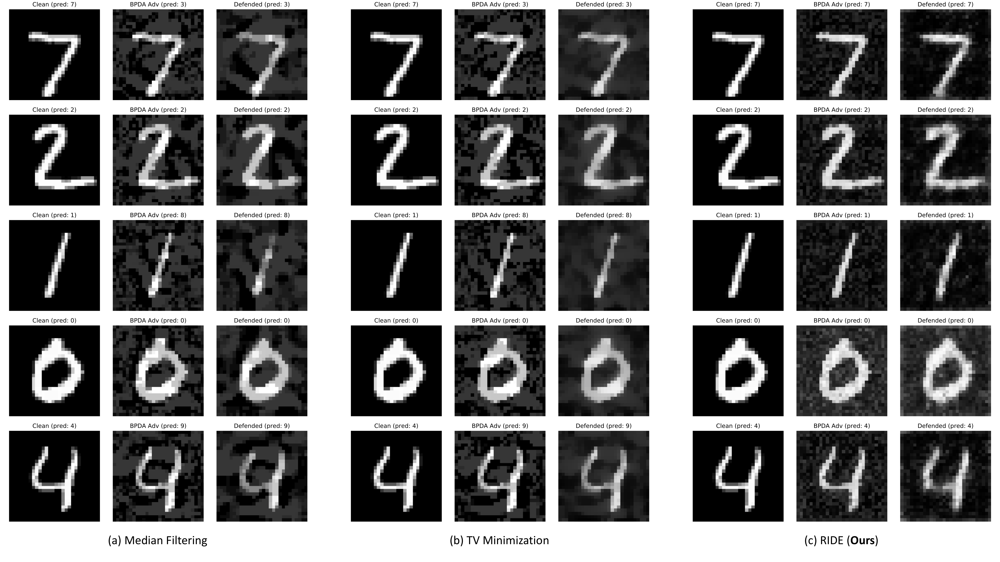

# White-Box Adversarial Defense via Self-Supervised Data Estimation

## Introduction

Deep learning classifiers are vulnerable to adversarial attacks that only introduce quasi-imperceptible perturbations to the input images, but can completely change the predictions. Here we proposed to use a **functional**, which is a *function of functions* to defense against adversarial attacks under the white-box setting. Specifically, we propose the **robust iterative data estimation (RIDE)** algorithm that returns a defender function for every individual adversarial image through the self-supervised optimization of a neural network. Our defender achieves state-of-the-art defense performance on image recognition. For details, please read the [preprint](https://arxiv.org/abs/1909.06271).

*Note*: work was done during an internship at [Mitsubishi Electric Research Laboratories (MERL)](https://www.merl.com). 

## Examples



**Figure 1 |** Qualitative results of the defense against 10-iteration white-box attack (PGD attack with BPDA) on MNIST dataset using (a) median filtering, (b) total-variance minimization and (c) the proposed RIDE algorithm. The predicted label of each image is shown on top of it.

## License
This project is licensed under the MERL Research License - see the [LICENSE](https://github.com/zudi-lin/RIDE_test/blob/master/LICENSE.md) file for details.

## Citation
If you find our work useful for your research, please cite:
```
@article{lin2019white,
  title={White-Box Adversarial Defense via Self-Supervised Data Estimation},
  author={Lin, Zudi and Pfister, Hanspeter and Zhang, Ziming},
  journal={arXiv preprint arXiv:1909.06271},
  year={2019}
}
```

## Contact
[Zudi Lin](https://github.com/zudi-lin)
